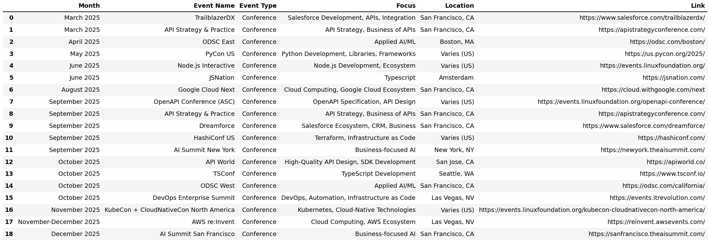
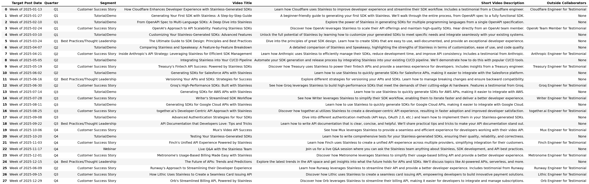
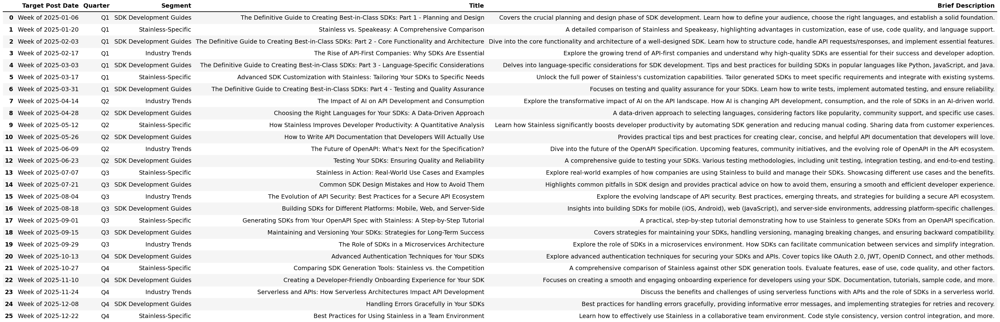

# :nut_and_bolt:  Stainless - Sharpened :nut_and_bolt:
## December 2024 - TMS

This project analyzes [Stainless](https://www.stainlessapi.com/), a company that generates SDKs from OpenAPI YAML specifications. The goal is to understand the product, business model and propose preliminary ideas through a hands-on and proof-of-concept approach. We've broken down the analysis into four segments: (1) Product, (2) Sales, (3) Marketing, and (4) Finance.

## :computer: 1. Product: SDK Generation 

The core of [Stainless](https://www.stainlessapi.com/)'s business is SDK generation - as well as upkeep - from OpenAPI YAML files. We've built an MVP to understand and demonstrate this process:

<video width="640" height="360" controls>
  <source src="1-Product/steel-sdk-demo-min.mp4" type="video/mp4">
  Your browser does not support the video tag.
</video>

We generate SDK configurations by parsing a provided YAML, prompting for the desired SDK language, and then using Jinja templates to create language-specific SDKs. This MVP helps us understand the underlying mechanics of products like [Stainless](https://www.stainlessapi.com/), [Speakeasy](https://www.speakeasy.com/), and [OpenAPI Generator](https://openapi-generator.tech/).

**Key Features of the MVP:**

*   **SDK Generation:** Creates Python and Node.js SDKs from local OpenAPI YAML files.
*   **README Generation for each Language:** Automatically generates a `README.md` for each SDK, outlining the API and its endpoints.
*   **YAML File Inclusion:** Copies the input OpenAPI YAML file into the SDK directory to have for reference.

**Next Steps for MVP Product Development:**

1. **Endpoint Test Generation:** Automatically generate test cases for each API endpoint within the SDKs.
2. **CLI Interface with Click:** Build a user-friendly command-line interface for the SDK generator using the Click library.
3. **Dockerization:** Containerize the application with Docker for consistent performance across environments.
4. **Automated Github Updates:** Learn how to automated SDK updates using GitHub Apps and Actions, triggered by changes to the YAML file. Explore automated pushing to remote GitHub repositories.

## :telephone_receiver: 2. Sales: Growth Engineering

The objective here is to identify potential customers via engineering-first approach. We've focused on three target groups:

1. **Public OpenAPI YAML Files:** We used [https://api.apis.guru/](https://api.apis.guru/) - an API that aggreagates API's - to source publicly available OpenAPI specifications, along with contact information, documentation links, and the YAML files themselves. A proof of concept to shower a creative ways of driving growth via sourcing OpenAPI YAML files. 
2. **API Companies:** Next we leveraged the power of web scraping. We developed a Playwright-based web scraper to extract a list of API companies from [API-Tracker](https://apitracker.io/). This approach can be extended to platforms like the Postman Public API Network.
3. **API Platform Engineers:** We then targeted People over Companies. We leveraged [Apollo](https://app.apollo.io/)'s database to identify US-based API platform engineers as a target audience.

This of course exludes plenty of other channels - namley targeting high growth AI & API first companies within the same investor ecosystem - but serves as a way to demonstrate creative and engineering-first approaches in growth. 

**Future Steps:**

Future steps involve:

*   **CRM Integration:** Unifying the collected data into a CRM such as [Attio](https://attio.com/) system and leveraging [Clay](https://www.clay.com/) for data enrichment.
*   **Lead Scoring:** Developing a lead scoring model based on fit and relevance.
*   **Scaled Outbound Campaigns:** Creating targeted campaigns using tools like Instantly.

## :mega: 3. Marketing: Content and Engagement Strategy

We propose a three-pronged marketing strategy:

1. **Events:** A calendar of relevant industry events to participate in.

    

2. **Video/Webinar Content:** A schedule for creating and publishing video content (e.g., tutorials, demos, webinars).

 

3. **Blog Content:** A plan for consistent blog posts covering technical deep dives, use cases, and industry insights.

    

Given the nature of the product, product-led and marketing-led will be key but the business can also uniquely target companies with public YAML files so focused sales will also be strategic. 

## :mega: 4. Finance: Competitive Landscape, Pricing, and Partnerships

We performed a preliminary competitive analysis to understand the ecosystem, identify potential partners, and get a sense of pricing models. We also began formulating a few investor-related questions based on our current understanding of the business. See `comps_and_ecosystem.json` for our competitive analysis. A few observations

*   **Speakeasy:** Notably the "K-Nearest Neighbor" comp. A few highlights are their Terraform offering for the infrastructure market and their local CLI which offers a more controlled SDK development experience. 

*   **Partnerships** Tre are interesting potential partnership opportunities in documentation (depending on Stainless's build vs. buy strategy), with CLI players like CircleCI, and API management companies like Kong, etc.

*   **Investor Questions:** We have compiled a list of investor questions in a separate document (`questions.md`) to further explore the financial aspects of Stainless's business.

## :scroll: Conclusion

This project provides a comprehensive analysis of [Stainless](https://www.stainlessapi.com/)'s business, focusing on their core product alongside potential ideas for sales strategy, marketing, and financial landscape. Have a few open questions: 

This project serves as a valuable starting point for anyone interested in understanding the intricacies of the API economy and the businesses that power it, especially the SDK generation space.

## Project Structure

*   **steel-cli/**: Contains the code for the "Steel" SDK generator.
    *   **1. Product/:**
        *   **\_\_pycache\_\_/:** Python bytecode cache.
        *   **output\_sdk/:** The generated SDK output directory.
        *   **spec/:** Example OpenAPI specification files.
        *   **templates/:** Jinja templates for SDK generation.
        *   **main.py:** The execution script.
        *   **requirements.txt:** Project dependencies.
        *   **sdk\_generator.py:** The core SDK generation script. 
        *   **steel-sdk-demo.mov:** A demonstration of the SDK generator.
    *   **2. Sales/:** Scripts and data related to sales lead generation.
        *   **api-guru-scrape.py:** Script to scrape API data from api.apis.guru.
        *   **api-tracker-pull.csv:** Data extracted from [API-Tracker](https://apitracker.io/).
        *   **api-tracker-scrape.py:** Script to scrape [API-Tracker](https://apitracker.io/) data.
        *   **openapi\_info.csv:** Information on scraped API guru.
    *   **3. Marketing/:** Proposed marketing schedules and assets.
        *   **api-events\_table.png:** Proposed schedule of API-related events.
        *   **api-events.json:** Data for the events table.
        *   **blog-schedule\_table.png:** Proposed blog content schedule.
        *   **blog-schedule.json:** Data for the blog schedule.
        *   **output.py** Script for generating marketing assets.
        *   **video-schedule\_table.png:** Proposed video content schedule.
        *   **video-schedule.json:** Data for the video schedule.
    *   **4. Finance/:** Data and analysis related to finance and competitors.
        *   **comps\_and\_ecosystem.json:** Information on competitors and ecosystem players.
    *   **venv/:** Virtual environment for the project (not typically tracked in Git).